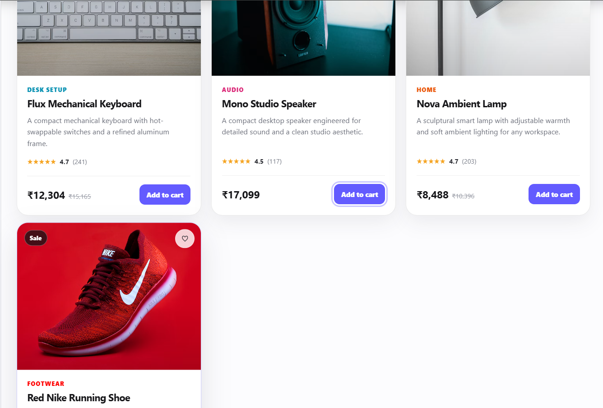

# Product Catalog

Focus: props, reusable components, composition, and list rendering.

## Tech
- React 19.2.8
- React DOM 19.2.8
- Vite 8.2.2
- JavaScript + plain CSS

## Run
npm install
npm run dev

## Structure
src/
├── components/
│   ├── ProductBadge.jsx
│   ├── ProductCard.jsx
│   ├── ProductGrid.jsx
│   └── ProductRating.jsx
├── data/
│   └── products.js
├── App.jsx
├── main.jsx
└── styles.css
 